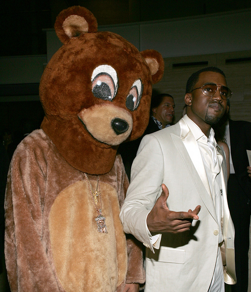
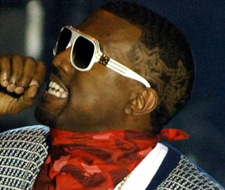

הביקורת הבאה כתובה בלשון זכר אך מיועדת לגברים ונשים כאחד.

נשים הן עם נוראי, אכזרי וחסר לב. וקנייה ווסט עשה על זה אלבום. 

אז קודם כל, עוד לפני ששמעתי את האלבום, ניסיתי לפשפש בזיכרוני מתי שמעתי על ראפר שעשה אלבום על שברון לב. לא רק כמה שירים – אלא אלבום קונספט על שברון לב. לא הצלחתי להעלות שום דבר באוב, אולי חוץ מ-''A Grand Don’t Come For Free'', אבל האלבום הזה הוא לא רק על שברון לב. לפי דעתי זה חסר תקדים (תקנו אותי אם אני טועה – בבקשה תקנו אותי, הייתי רוצה לשמוע אלבום כזה). לכן המשמעות כאן היא לא פחות חשובה מהאלבום עצמו. אישה חסרת לב אמרה לי פעם שדוסטוייבסקי אמר: ''אני נהנה מהחיים ולא ממשמעותם'', אבל לדעתי זה קשקוש מוחלט והמשמעות פה משחקת תפקיד חשוב מאוד בהתפתחות ההיפ הופ של השנים האחרונות. מה שהתחיל (לפחות בשבילי) אצל אנדרה 3000 (וביג בוי, אבל בעיקר אנדרה), נמשך אצל קנייה במה שאפשר לכנות המודל החדש של הראפר האמריקאי – או המטרוראפר, אם יורשה לי לטבוע את המושג. 

אז מה מבדיל את קנייה משאר הראפרים? סיכם את זה הכי טוב קנייה בעצמו באחד השירים מאלבום הבכורה המדהים שלו: ''We’re all self conscience, I’m just the first to admit it''. קנייה לא מפחד להגיד את האמת, לגלות את הסוד הכי שמור בעולם המוזיקה האמריקאי – גם ראפרים הם אנשים, אנשים חלשים. דווקא החולשה של קניה, היא מה שהפכה אותו לכל כך חזק. כשפיפטי וחבריו מקשקשים על רימס, הוז ומנגבים ת'תחת בקליפים עם שטרות של 100$, קנייה מדבר על שכ''ד ועל איך אף אחד לא החתים אותו בתחילת דרכו. בזמן שפיפטי (מצטער, אני לא אוהב את הפוזה) שר על זה שירו בו 17 פעם, קנייה שר על תאונת הדרכים הקשה שעבר. אולי העובדה שהוא לא היה סוחר סמים כמו ג'יי זי ולא גדל בקומפטון כמו אייס קיוב, אלא בפרוור של שיקגו, עם משפחה מתפקדת, הפכה אותו לאנטי-תזה לראפר המצוי, וזה סוד הקסם.

דב זה הבן זוג החדש

ובחזרה לאלבום. לאחר שלושה אלבומי מופת, שאמנם פחתו באיכותם מהאחד לבא אחריו, אבל היו אי של כשרון בים של זבל ממוסחר, עשה קנייה שינוי קיצוני. בעקבות השינוי הקיצוני בחייו – מותה של אימו, עקב בוב ג'וב שסרח והפרידה מארוסתו, קנייה החליט (בצדק) שהוא גם ככה גדול מהחיים, אז בשביל מה לעשות עוד אלבום שיימכר כמו לחמניות חמות? במקום זה, הוא החליט להשתמש ביצירה כדי לתעל את הרגשות שלו, כן כן אני מזכיר את המילה ראפר ורגשות באותו משפט. כבר אמרנו שקנייה מיוחד?

אז הוא לקח אוטו-טיון, מכשיר שדווקא מזוהה עם ראפרים בשקל ו-Cher בשנות התשעים, 808 – מכונת תופים אייטיזית, והתחיל לשיר - לשיר על הכאב שבפרידה. התוצאה באמת מהפכנית, אם כי ברור לכל שזה לא אלבום מסחרי; יש שם אולי שיר וחצי שיצליחו בתור סינגל או ברדיו (זה הניחוש שלי). זה פשוט אלבום חורף קלאסי, על פרידות ושברון לב... אבל של ראפר. 

לכל מי שחווה שברון לב בחייו (גברים. לנשים, כאמור, אין לב) לא קשה להזדהות עם המילים של קנייה. כבר בשיר הפתיחה קנייה מודה שהוא עדיין מפנטז על אהובתו, הודאה קשה במיוחד כשהאגו שלך הוא בגודל של ויסקונסין.
מצד אחד, קנייה הוא שחצן ידוע, ומצד שני הוא מסוגל לפתוח את כל הקלפים, לשים הכל על השולחן. 

''Welcome To Heartbreak'' מכניס אותנו לריקנות של חייו; קנייה לא סופר את כל הפרסום והכסף, בסוף אין לו את מי לקחת לחתונה של אחותו והוא גם צריך לעזוב מוקדם. 

Love Lockdown'''' ו ''Paranoid'' הם הסינגל וחצי שעוד מזכירים קצת את הסטייל הישן של קנייה, בעיקר Paranoid'''' – שיר נפלא וקצבי כמו שקנייה יודע, שבו הוא מבטיח לאהובתו שאין לה מה לדאוג, ושלמרות המעריצות והפרסום הוא יישאר נאמן לה, אך מיד אחר-כך ב–''Robocop'' (כך הוא קורא לה - גאוני) הוא מתבכיין על האישה הקנאית שלו, שמרגלת אחריו כמו הבחורה ממיזרי. 

עוד הודאה מרגשת נמצאת ב-''Bad News'', בו קנייה מודה שחיכה לה שתתקשר אליו בחזרה, אך שמע חדשות רעות שהיא כבר עם אחר וכשהתבשר על כך התנהג כאילו כבר שמע אותן כדי לא להראות סימנים של חולשה. זו תכונה כל כך אנושית, וכל כך נדיר לשמוע אנשים שמודים בה. בהמשך הוא גם מבין שהחדש הוא לא כל כך חדש, ושלנשים תמיד יש תכניות מגירה, נוראיות כבר אמרתי?

Lil Wayne בא לעזור ב-''See You In My Nightmares'' ומצליח לא לקלקל (לא ברור איך זה קרה, אבל לאנאלפבית הזה יש את האלבום הכי נמכר בארה''ב כרגע) את שיר השנאה. חייבים שיר שנאה באלבום שברון לב, שבו מכריז קנייה שהוא לא אוהב אותה יותר. עד לפעם הבאה. 

האלבום נחתם בקטע המרגש במיוחד מהופעה חיה, בו קנייה עושה פריסטייל ושוב מקונן על חיי הזוהר ועל כך שהוא רוצה חיים אמיתיים. ''Pinocchio Story'' הוא תמצית האלבום: לא נאמן לז'אנר, לא הצלחה מסחרית, אבל מגיע מהלב. והלב של קניה שבור.

