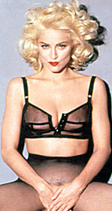
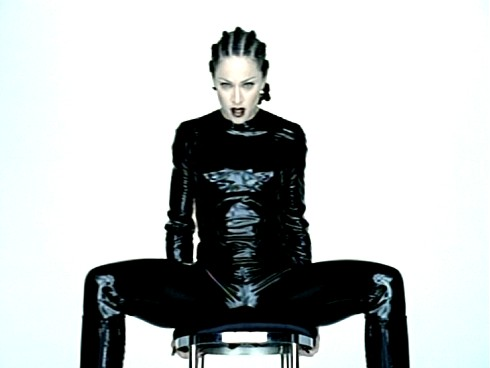

ברמת העיקרון, שינוי תדמית תמיד נשמע לי כמו יוזמה מאוד חשודה. בכלל, כשאנשים שלא מרוצים עם איך שהסביבה תופסת אותם, כנראה שיש סיבה טובה לכך. נכון שלפעמים התוצאות יכולות להיות מאוד מעניינות, אבל ''מעניין'' זו מילה שהמציאו נשמות טובות בכדי להימנע ממילים אחרות –כמו ''זוועה'', או ''כישלון'', או סתם ''אסון''. במקרים מאוד נדירים יוצא מזה משהו טוב - על אחת כמה וכמה כאשר מדובר באמן.

ולכן, כשגיליתי שלמדונה יש אלבום ששונה לגמרי מכל מה שהיא עשתה עד שהוא יצא, מיד נדרכתי. 
בסופו של דבר, לפני עידן ה-''קבאלה'' היה מדובר באישה שיום העבודה הרגיל שלה כלל אוננות פומבית במהלך הופעה חיה מול חמישים אלף איש, בעודה לובשת חזיית שפיצים ופאה ויקטוריאנית. אם האישה הזו, שתדמיתה המינית הוקצנה מאלבום לאלבום, מתכוונת לשנות תדמית, למען השם, מה הולך לצאת מזה?

בניגוד לכל הסיכויים, מה שיצא הוא אלבום מצוין, חדשני, מקורי והכי חשוב – משהו שעוד אפשר להתפתח ממנו. רק שנתיים לפני כן יצא “Erotica”, אלבום שגרם לכוכבות פורנו להיראות כמו דודות של האגודה למען החייל והפך את מדונה לאטרקציה הגדולה ביותר בעסקי המוזיקה שלא קשורה בכלל למוזיקה. וזה לא שלפני זה היא הייתה ילדת צופים. אם להיות הוגנים, האלבום הכיל כמה מהלהיטים הכי גדולים ברפרטואר הענק של מדונה, כמו Rain, Fever, Deeper and Deeper, ואפילו מכר לא רע, באזור ה - 3.5 מיליון.

אבל זו הייתה בדיוק הבעיה: כולם ציפו שזה מה שמדונה תעשה. הם ציפו שתגנח, תצרח ותשכח את היכולת שלה לזקק פופ מושלם. הם רצו שתישאר במקום שבו היא הייתה – הפרובוקציה התורנית, כדי שיוכלו לבעוט בה. אז במשך שנתיים מדונה ספגה, הפנימה, והביאה לנו את “Bedtime Stories”, שבניגוד מוחלט לשמו, ממש לא ניסה להרדים, ועשה את ההפך הגמור.

בואו נגיד ככה: אם “Erotica” היה חד וישיר כמו הצלפת שוט מעור, “Bedtime Stories” היה רך, מתפנק ומרומז כמו צעיף סאטן. אז מה, מדונה נרגעה? הצחקתם אותי. לא רק שיש שם סקס בטונות, הוא עובר הרבה יותר חלק מאשר באלבום שלפניו. במובן מסוים, מדונה לא באמת שינתה תדמית. אולי רק תנוחה.

על מה מתערבים שעוד כמה שנים יגידו שאני ליידי בריטית?

כדי להשלים את המיני-מהפך הזה, גייסה מדונה לעזרתה כמה מהשמות הגדולים באותה תקופה. הבולט שבהם - איש הטריפ הופ נלי הופר, שעבד עם U2, סניקר פימפס, גארבג' ומאסיב אטאק. השני - קנת' אדמונדס, שידוע יותר בכינוי ''בייביפייס'', ושהפיק כמות היסטרית של להיטי RnB, בין השאר לטוני ברקסטון, ויטני יוסטון – ועבד גם עם אריק קלפטון, לאלו מביניכם שמעדיפים בון-טון.

במקור, Bedtime בכלל יועד להיות המשך ישיר ל- ”Erotica”, עד שמדונה נזכרה שהיא בקטע של שינוי תדמית והכול, וביקשה משפ פטיבון, המפיק של “Erotica” והאחראי העיקרי להתייחסות למדונה כאל בובת מין מזמרת, לפנות את מקומו. התוצאה הייתה שינוי פאזה חריף:
מפופ-פרובוקציה, לRnB- - ז'אנר שמדונה טרם התנסתה בו לפני כן. מעודן או לא, RnB או לא, Bedtime הפך לאלבום החשוף והישיר ביותר של מדונה (לפחות עד “Ray of light''), מכל בחינה שהיא. הוא הצליח לשדר פתיחות, חום, הבנה, והרבה כוח נשי.

מאוד קל ליפול למלכודת השמאלץ כשמתעסקים עם בלדות RnB, אבל מדונה הצליחה להתחמק ממנה בקלות מפתיעה, ומסבירה בעצם את כל הסיפור בשורה הראשונה של Survival, מעדן נשמה קצבי ולא מתחנף:

''לעולם לא אהיה מלאך/ לעולם לא אהיה קדושה , זה נכון
אני עסוקה מדי בלשרוד/ גן עדן, או גיהינום/ אני אחיה בשביל לספר''.

מיד אחריו מגיח Secret, המגה להיט הראשון של האלבום, שמאות אלפי השמעות שחקו אותו עד דק, ובכל זאת – בס סקסי, הרמוניות כפולות ושירה מלאכית של מדונה – שמעולם לא הייתה ידועה ביכולותיה הקוליות. אי אפשר שלא לשמוע אותו עוד פעם אחת. לא נפקד גם מקומו של הוידאוקליפ, שהראה (שוב) כמה מדונה יכולה להיראות טוב בשחור לבן. I’d Rather Be Your Lover הוא, בהעדר הגדרה קולעת יותר, פיתוי עטוף היטב, שקטע הראפ המתחכם באמצע הרצועה רק מוסיף לו חן. על מה הסיפור? בשתי מילים:

''אני יכולה להיות אחותך, חברה שלך, אפילו אחיך/
אני מעדיפה להיות המאהבת שלך/ בוא ננסה''.

ועכשיו תגידו לא למדונה.

בואו נוריד הילוך. היה לנו מספיק משחק מקדים, סודות, הישרדות– בואו ניגש לעסק.
Inside Of Me, בעל השם הדו משמעי, נפתח בנשיפות רכות. אל דאגה, זו לא אותה מלכת סאדו מבהילה מהאלבום הקודם – זו מדונה אחרת. מחיאות כפיים חרישיות, בסים אווריריים, טמפו עדין – ושוב מדונה מגישה ביצוע ילדותי/סקסי, מלטף כמו דבש.

כן, חמוד, אתה יכול לקרוא לי 'אסתר' אם זה מה שעושה לך את זה

בשלב הזה נזכרת מדונה שיש לה כמה אנשים לסגור איתם חשבון, כמו למשל התקשורת שנדחפה לה לחיים ואלו שהפכו אותה לסמל הפריצות והתועבה עם היציאה של Erotica והספר Sex, והיא שולפת שיניים, ציפורניים ואת Human Nature:

''אני לא מצטערת/ זה טבע האדם
אני לא הכלבה שלכם / אל תפילו את החרא שלכם עלי
ניסיתם לדחוף אותי/ חזרה לתוך החדר הצר שלכם
ולהשתיק אותי עם מרירות ושקרים''

לאמור: ''אל תתעסקו איתי. אולי אני שרה על סקס וכל זה, אבל אל תידחפו לי לנשמה, או שאני אכנס בכם''. 

מכאן מדונה כבר לא מפסיקה להפגיז: Forbidden Love הוא לטעמי השיחוק הגדול של האלבום: בלדה מושלמת, קצב, ליווי, מילים, מבנה – ניצחון ושיר לאב-מייקינג קלאסי. הזכרנו בחטף את Ray of Light, שהרבה טוענים שהוא האלבום הטוב ביותר שלה. לא נתווכח כרגע אם זה נכון או לא (וזה לא), אבל כאן מראה מדונה סימנים ראשונים לשחרור מהקו הפופי שכבר ב- ”Erotica”התחיל למצות את עצמו – ומביאה אותה בשתי יציאות אלקטרוניות. הראשונה: Sanctuary, שמתרחקת מהקו המלטף והעדין שקיבלנו עד עכשיו, וגורמת למדונה להישמע כמו כוהנת וודו תחת השפעה. השנייה היא כבר אחת הרצועות המקוריות ביותר שיצאו אי פעם מתחת ידיה של מדונה, שאף פעם לא חסרה לה מקוריות. Bedtime Story, בטייק אוף על שם האלבום, היא רצועה מהפנטת, סוחפת, קטע מתוך הזיה מטורפת. נלי הופר וביורק תרמו את המילים וההפקה, והניצן הראשון לתקופה האלקטרונית של מדונה נבט. 

כמה שנים אחר כך, מדונה שוב תשנה תדמית ותחבור למפיק ויליאם אורביט, בדרך לאלבום חדשני אחר ולשינוי תדמית נוסף. אבל למשך זמן קצר, היא הייתה הפיה המפתה והמתוקה של 
Bedtime Stories, שהשאירה טעם טוב אחרי הקולניות והגסות של Erotica. למרבה הצער, מעטים מהשירים שהיו באלבום ליוו את מדונה בהמשך סיבובי ההופעות, ומקומו של האלבום נפקד מהיצירה שלה. כנראה שלא כולם אוהבים מתוק. ואתם?

<iframe width="420" height="315" src="http://www.youtube.com/embed/CSaFgAwnRSc" frameborder="0" allowfullscreen></iframe>
