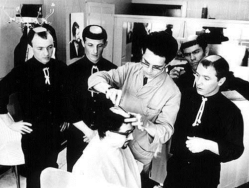
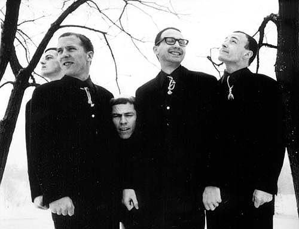

פרנק זאפה, אדם שאני אוהב ומעריך את דעתו, אמר פעם שדבר טוב שניתן לומר על הסיקסטיז הוא, שזו תקופה שבה יצאה לאור כמות נכבדה של מוזיקה ניסיונית. ההסבר של זאפה לתופעה היה, שכשמנהלי חברות התקליטים שמעו את האלבומים ההזויים שהאמנים יצרו מהכסף שלהם, הם אמרו משהו כמו: ''אין לי מושג מה זה הדבר הזה, אבל בואו נוציא את זה בכל מקרה''. אמר, וצדק. משהו היה שם באוויר. אחד מתחביביי המוזיקליים הוא איסוף של פנינות ביזאר סיקסטיז משובחות: מה-Silver Apples הנהדרים, שכבר כתבתי עליהם מילים רבות כאן, דרך להקות פסיכדליות נפלאות כמו The United states of America, Pearls before Swine ו-13th floor elevators, ועד אמני ביזאר נהדרים כמו ארתור בראון ו-Twink. האלבומים הנשכחים הללו, שהחל משנות התשעים הייתה להם עדנה מפתיעה ומבורכת, הם משהו שלא היה ולא יהיה כמותו. הרכב נוסף, שרק לאחרונה נתקלתי בו והרגשתי חובה מוסרית כלפי קוראי השרת, ולכן ניגשתי לכתוב עליו, הוא של חבורה של חמישה חיילים אמריקאים זועמים בשם The Monks.

הסיפור של המונקס מתחיל במקום לא ממש שגרתי ללהקת גאראז' פסיכדלי פורצת גבולות: בסיס חי''ר אמריקאי בגרמניה. גארי ברגר, לארי קלרק, דייב דיי, אדי שואו ורוג'ר ג'ונסטון, חמישה חיילים משועממים ושבוזים (ניחוש שלי, לפי המוזיקה שלהם) מחליטים להקים להקה לאחר שחרורם, להופיע בגרמניה ולנגן סטרייט רוקנרול, פשוט וחינני, תחת השם The Torquays. די מהר, נמאס לחברי הלהקה לנגן צ'אק ברי, הם מחליטים להתנסות בכתיבה יוצרת ויצירתית, ולהפוך את הלהקה למעבדה רוקנרול. אנחנו מדברים על 1964-1965, שנים בהם קונספט להקת הרוק רק החל לקרום עור וגידים, וגם הפסיכדליה המתקתקה של מפגש הרחובות הייט-אשברי בסאן פרנסיסקו רק מתחילה לזלוג החוצה. המונקס יכלו בקלות להיות אופנתיים ולהפוך לעוד להקת סיקסטיז אמריקאית: פיס אנד לאב, קצת סמים מרחיבי תודעה והמון שירים בסולם די מז'ור. אבל המונקס, כמו להקה ניו יורקית אלמונית בשם The Velvet Underground, קורצו מחומר אחר, חומר אפל.

מה כל כך מיוחד במונקס, תשאלו? לפני הכל, המונקס ניגנו מוזיקה אחרת, שונה מאוד ממה שהסתובב בעולם הרוק באותה תקופה. אצלם לא היו שירי פיס אנד לאב. כמו הכנופיה של ריד וקייל, וגם קצת כמו מר ג'ים מוריסון וחבריו, המונקס פיתחו טוויסט אחר למוזיקת גאראז', שהיה אפל, קשה ובעיקר שלילי. הם יצרו מוזיקה קשה, נוקבת ובועטת, ובעיקר-מקורית עד כדי השתאות. אף אחד מחמשת נגני הלהקה אינו נגן קונבנציונלי. נתחיל מהסולן והגיטריסט הראשי, גארי ברגר. ברגר ניגן ושר בצורה קיצונית ופרועה באופן חסר תקדים: הוא היה מראשוני משתמשי הפידבק כהצהרה אומנותית, הוא היכה בגיטרה באופן חסר רחמים, הוא גיבש סאונד פאזי שבעיניי הוא כמעט מושלם לגיטריסט רוקנרול, ולמרות שבלי ספק שמעתי גיטריסטים מוכשרים יותר, שמעתי מעט גיטריסטים עם כל כך הרבה נוכחות. באשר לשירה שלו- היא הייתה לא פחות פרועה, ועוד נעמוד על כך. דייב דיי, הגיטריסט השני בלהקה, החליט שגיטרת קצב זה לא זה, ועשה הסבה לבאנג'ו, לא פחות, ועוד תקע לו שני מיקרופונים בקרביים. המעבר מגיטרה לבאנג'ו נתן ללהקה צליל צורמני, חד וחריף, הכלאה בין גיטרה למראקאס. לארי קלרק, האורגניסט, היה המקבילה לגיטרה של ברגר וניגן גם באופן משולל רסן, ומאוד מאוד רועש. הרית'ם סקשן העצבני של הלהקה היה שיא החידוש- רוג'ר ג'ונסטון חבט בתופים בשבטיות שמזכירה את דראמבו, המתופף הנפלא של קפטיין ביפהארט, והבסיסט אדי שואו היה לדעתי הבאסיסט הראשון בהיסטוריה שניגן עם פאז. 

אבל כאן לא תמה המקוריות של הלהקה. השירים עצמם היו מאוד חריגים לנושאים המצומצמים שבהם נהגו להקות רוק לעסוק באותו זמן. השירים ששרו המונקס (ברגר, בגיבוי קולות רקע של שאר הלהקה) התאימו כמו כפפה לגישה השלילית והמתריסה של המוזיקה: שילוב בין הומור שחור, דאדא וזעם טהור. אם כל זה לא מספיק בכדי לעורר בכם אימה, המונקס גם החליטו לגבש לעצמם לוק וקונספט ייחודי מאוד בעולם הרוק: הם הופיעו מחופשים לנזירים אמיתיים, כולל גלימות וחבלים, ואף הקצינו וגילחו את ראשם לתספורות נזירים מסורתיות, בלי ספק התספורות המשונות ביותר במוזיקת הרוק מאז ומעולם. עם לוק כזה, ומוזיקה כזו, לא פלא שהמונקס קיבלו כל כך הרבה תגובות מעורבות, כולל מקרה של אדם שניסה לחנוק את גארי ברגר בעוון חילול קודש. המונקס הצליחו להקליט אלבום אחד, Black monk time, להוציאו בשנת 1966 ולהתפרק די מהר אחר כך. לכבוד אלבום זה התכנסנו כאן היום.

Black Monk Time נפתח בבום נהדר, עם שיר הפתיחה המקפיץ “Monk Time”. בתוך 20 שניות אפשר להבין שמה ששומעים כאן, לא שומעים כל יום: התופים מכים, הבאס כבד, הבאנג'ו הביזארי נשמע כמו גרוטאה שמכים בה ברצפה, ואז מגיע הקול המאומץ, המיוסר והמוטרף לחלוטין של ברגר, וצורח את המילים הבאות:

“Alright, my name’s Gary,
it’s beat time, it’s hot time, it’s monks time!
We don’t like the army, what army, who cares what army?
Why do you kill all those kids over there in Vietnam?
Mad Viet Cong! My brother died in Vietnam!”

בום! איזו זפטה לפנים מחמישה יוצאי הצבא האמריקאי. בבית אחד הם משמיצים גם את צבא ארה''ב ההורג ילדים מוויטנאם, ומיד אח''כ מספר גארי על אחיו שנהרג בוייטנאם (אני מניח שמדובר בשטות). ואז ממשיך גארי:

“James Bond, who is he?
Stop it, Stop it, I don’t like it! It’s too loud for my ears!
Pussy Galore is coming down and we like it.
We don’t like the atomic bomb!”

וכך, בתוך דקה אחת של שיר, מתערבבים להם נושאים הרי גורל כמו מלחמת וייטנאם והפצצה הגרעינית עם אייקוני פופ כמו ג'יימס בונד. מה לעזאזל הקשר? למה ברגר צורח כמו כלב צ'יוואווה מוכה כלבת? למה הגיטרה שלו נשמעת כאילו היא מוכת צרעת? מה לעזאזל לא בסדר עם הבאס הזה? למה הקלידים כל כך פאראנואידים? ומה פתאום יש פה באנג'ו חורקני כזה? ולמה זה כל כך קופצני, מלהיב, וכל כך, כל כך טוב?!

אז זה שיר לדוגמא של המונקס. 

והאחרים לא פחות משונים, מעוותים, אפלים, מפחידים ואדירים. יש באלבום המקורי 12 שירים שכולם נעים בין דקה וחצי לשלוש דקות של דאדא כייפי טהור, שלא נשמע כמותו עד אז, ופעמים מעטות נשמע כמוהו מאז (אני יכול לחשוב בעיקר על אלבומים מסוימים של זאפה, קפטיין ביפהארט ו-Here come the warm jets הנצחי של בראיין אינו). בסדרה בלתי נגמרת של שירים מנצחים, חובטים המונקס במאזין האומלל שוב ושוב בשירים הזויים על נושאים בלתי ברורים, בתזמור ועיבוד בלתי מובנים בעליל, ו-וואו, כמה זה טוב! קחו למשל את השיר המופתי ''I hate You''. במקצב מגרש גרוטאות, שר ברגר בקול מיוסר וחולני:
“I hate you with a passion baby!!!”
וחבריו ללהקה צועקים, בקורוס בלתי נשכח
“But Call me!”
למה הוא שונא אותה, תשאלו? ההסבר הוא- בגלל שהיא גורמת לו לשנוא אותה! השיר כל כך מהמם, הן בקצב האיטי והמבעבע שלו, הן בזכות סולו גיטרה מפיל של ברגר, והן בכך שכל love מוחלפת ב-hate. ומה לגבי השיר הגאוני “Complication”,בו מטיחים ברגר ושות' שוב ושוב: 

“People cry,
People die for you.
People kill,
People will for you.
People run,
Ain't it fun for you.
People go
To their deaths for you”

שירים אחרים מצטיינים בדאדאיסטיות שלהם. למשל, השיר המבריק “Drunken Maria” מכיל רק את שתי השורות הבאות : “Drunken Maria, don’t sleep/sleepy Maria, don’t drink”, או השיר “Higgle-Dy-Piggle-dy” שמורכב מכמה הברות טפשיות ותו לא, או הבלוז הסופר-מטופש ''“We Do Wie Du. בשירים האלו מראים המונקס יכולת אדירה לכתוב שירים מאוד רקידים, קליטים ונפיצים, שלא ניתן לומר שיש להם משמעות כלשהי-במכוון. 

בקיצור, המונקס עושים רוקנרול, אבל זה הרוקנרול שלהם, לא של אף אחד אחר. יש משהו מהותי, עמוק עמוק במוזיקה של הלהקה, שהוא מושחת, מעוות וגועלי. אבל הם עושים את זה כל כך טוב, שאין ברירה אלא להתמסר להם. למרות הפרסונה השערורייתית של הלהקה, האלבום הקצרצר (בסה''כ 30 דקות) כשל במכירות, הלהקה הקליטה עוד כמה שירים בסגנון הרבה יותר שגרתי ו...חיובי (ארבעה מהם מופיעים כבונוס לאלבום, והם הרבה הרבה פחות טובים מהסטנדרט שמציב האלבום). פנינת ביזאר כמו המונקס, להקה שאפילו ביחס לסיקסטיז נשמעת כאילו נחתה מכוכב אחר, לא יכלה להצליח בזמן אמת. האלבום הפך, כצפוי לאלבום קאלט שלהקות כמו הביסטי בויז ו-The Fall ציינו כהשראה. אולי רק בשנת 1966, כשאף אחד עוד לא ממש הבין איך מוזיקה פסיכדלית 'אמורה' להישמע, להקה כמו מונקס יכלה להתקיים. 

נסו ותהנו.

<iframe width="420" height="315" src="http://www.youtube.com/embed/rwO71Jfz0Z4" frameborder="0" allowfullscreen></iframe>