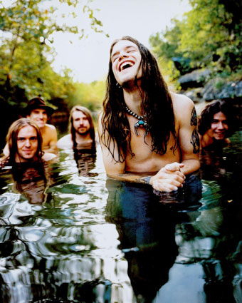

רוב האנשים זוכרים את בליינד מלון כוואן היט וונדר של No Rain במקרה הטוב, והקליפ הזה עם הבחורה בתחפושת של דבורה במקרה הרע. למען הסר ספק, בליינד מלון היו שותפים מלאים למהפכת הגראנג' של הניינטיז. אם אתם רוצים לדעת את האמת, בליינד מלון היא כנראה הלהקה הכי אנדר-רייטד בניינטיז ואחת מהאנדר-רייטד בהסטוריה של המוזיקה. 

בשתי מילים, בליינד מלון הם דכאון שמח. במהלך מסעותיי בשידורים החוזרים של ערוץ 8 נתקלתי פעם בסרט דוקומנטרי על אביב גפן, ובקטע נהדר בו הוא יושב בוואן בדרך להופעה ושר את "אני הולך לבכות לך תהיה חזק למעלה" עם הלחן של "אני פורים שמח ומבדח". כך גם בליינד מלון, שילוב של הדכאון של אליס אין צ'יינס והפאנק של הרד הוט צ'ילי פפרס. המילים אמנם מדכאות עד כאב, אבל הגרוב, הפאנק והגיטרות לא יכולים להשאיר אותך מדוכא. רק אם תקשיב למילים.

ואם בדכאון עסקינן, חייבים להזכיר את שאנון הון, סולן הלהקה זצ"ל. בנוסף לעוול שבאלמוניות הלהקה, גם אלמוניותו היחסית של הון היא עוול לא קטן, כאשר ברור (לי. לכם לא?) שהוא נכלל באותה רשימה של קולות שמיימיים שבקעו מהניינטיז כמו אלו של קורנל, וודר, סטיילי ולאנאגן. יכול להיות שהטרגדיה שלהם מערפלת את האובייקטיביות שלי, אבל בעיני סטיילי והון באמת יוצאי דופן, ודווקא הם אלו שנקטעו בשיאם כשמתו ממנת יתר. לקול של הון, כמו זה של סטיילי, יש דרך לא ברורה לחדור אפילו את הלב המשוריין ביותר. הוא רך וקשה ביחד, דק וגבוה אבל גברי ומחוספס. באמת קול ששייך לגן עדן.

אפשר להרגיש את הטרגדיה בחייו ובמותו של הון לכל אורך האלבום. כמעט בכל שיר ישנה וריאציה כלשהי על "אלוהים, עזור לי”. עם זאת חייבים לציין שהאלבום מפוצץ הגיטרות הזה מצליח להעביר יחד עם המלנכוליות והבדידות גם הרבה כיף (ע"ע No Rain), משהו שכאמור מבדיל אותם משאר להקות הגראנג' הטיפוסיות של הניינטיז. Deserted, Soak the Sin, Tones of Home הם שלוש דוגמאות שמייצגות נאמנה את סגנון הדיכאון השמח. כשצוללים לעומק המילים מבינים את המצוקה של הון. ב-Tones, למשל, הוא מתלונן על כך שאיש בעולם אינו מבין אותו ולכן הוא חייב לברוח. ב-Soak The Sin הוא כבר מפנטז על מה יגיד לאימו אם אי פעם יחזור. I Wonder, הסכיזופרני במילים ובלחן, מסתמן כשיר הכי טוב שפרל ג'אם מעולם לא כתבו. המילים באמת כואבות כשהון מתאר את התחושה הקשה של להיות כלוא כאשר כולם מסתכלים עליו, ונחתם במשפט המצמרר I only wanted to be sixteen and free.

אם להודות באמת, בכל פעם שאני שומע את האלבום אני לעולם לא מגיע ל-No Rain, אלא תמיד נתקע בשיר אחד לפניו – Change – ונשאר שם. צ'יינג' הוא אחד מאותם השירים שכמאזינים להם בפעם הראשונה, פתאום בלי שום הסבר שיערכם סומר ולחלוחית מתחילה לבצבץ מזוית העין. אם זה קרה לכם, אתם יודעים על מה אני מדבר. אם לא, תקשיבו לצ'יינג'. כל השיר הזה צועק "נו! תבכו כבר!”, החל מהמפוחית בפתיחה, דרך נגינת המנדולינה, ועד המילים הנבואיות של הון שלימים נכתבו על המצבה שלו: 

But I know we all can't stay here forever, 
so I want to write my words on the face of today and then they'll paint it.

המשפט האחרון בשיר מתגלה במלוא האירוניה כתובנה היחידה אותה לא השכיל הון ליישם – When life is hard, you have to change. ואם כל זה לא מספיק, ב-2007 עלתה בתו של הון, ניקו, להופיע עם חברי הלהקה ושרה איתם את צ'יינג', כשהיא מחליפה את אביה כסולנית ומגיעה בדיוק לאותם תוים שהוא הגיע, כמו שכנראה רק במשפחת הון יודעים. אחר כך מגיע, כאמור, No Rain – ממתק לא קטן שפשוט אי אפשר להיפטר ממנו. אבל את זה אתם בטח כבר יודעים. עכשיו תקשיבו לכל השאר.

<iframe width="420" height="315" src="http://www.youtube.com/embed/Yn1WbBaWTdc" frameborder="0" allowfullscreen></iframe>