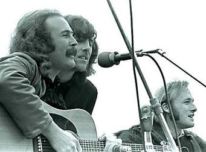
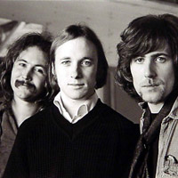

המושג Super group קרם עור וגידים לראשונה ב-1968, כשהאלבום ''Super sessions '' יצא לאור. האלבום של מייק בלומפילד, אל קופר וסטיבן סטילס היה ונשאר יצירת מופת, שילוב של 3 גיטריסטים מהמוכשרים בדורם (בוב דילן אמר על בלומפילד שהוא נגן הגיטרה הטוב ביותר ששמע מעודו, והוא זה שדחף אותו לעשות את המעבר מפולק לבלוז ומגיטרה אקוסטית לחשמלית), שנפגשו יחדיו לריפ אחד גדול של כמעט שעה. בי''ס לגיטרה. אבל לטעמי, לא רק שההרכב הזה הוא לא הסופר-גרופ הטוב ביותר, הוא אפילו לא הסופר-גרופ הטוב ביותר שבו השתתף סטיבן סטילס.

מאוחר יותר באותה השנה, חבר סטילס (יוצא הבאפלו ספרינגפילד ואייקון מוכר בעולם הרוק כבר באותה העת) לדיוויד קרוסבי (יוצא הבירדס, שספק הועף מהלהקה בעקבות השיר החתרני Triad'''', שדיבר על חיים בשלישייה, ושאר חברי הלהקה סירבו להכניסו לאלבום המקורי ב68') ולגרהאם נאש(אקס-הוליז ומנעד צלילים מרשים בזכות עצמו), וביחד הם יצרו את CSN ואת האלבום הראשון שלהם תחת אותו השם, שאותו הוציאו ב-69'. אפשר להתווכח האם האלבום הזה הוא הטוב ביותר של השלישייה, יש שיאמרו ש-Deja Vu הוא יצירת המופת האמיתית, אך בשבילי האלבום הזה נוגע הרבה יותר עמוק, והנה ההסבר מדוע.

קיץ 2001 – החופש הגדול האחרון לפני שמתגייסים. במהלך שוטטות בחנות הדיסקים הקרובה, נתקלתי במבצע הנצחי ''3 ב-99''. באותם הימים, הייתי על סף פריצת הדרך המוזיקלית בחיי, ובהשראת חכמים ממני קניתי את Blue, Forever Changes וכמובן את Crosby, Stills and Nash (עסקה די טובה, לא?). באותו הקיץ, כשטסתי לטיול לפני גיוס לאחד מחופיה המשמימים של יוון (אוי אלוהים, איזה ילד הייתי!), כנראה הוגש לי ציזיקי מורעל וחטפתי קלקול קיבה מהקשים בחיי. כששאר החברים פיזזו במסיבות הליליות, נשארתי לבד בחדר עם הדיסקמן, רק אני, CSN וחיידקי הסלמונלה שבבטן. אז הייתה הפעם הראשונה – כל פעם ראשונה של שמיעת אלבום היא מיוחדת, ובכל זאת, האלבום הזה היה משהו אחר. 10 רצועות, בסטנדרטים של אז – אורך בינוני, אך מה שהאלבום הזה מחסיר בכמות הוא מחזיר פי כמה באיכותו הווקלית והמוזיקלית המדהימה.

הוא נפתח בצורה מושלמת – הבלדה של סטילס על Judy blue eyes, אולי השיר הכי מפורסם של ההרכב, ואיזה שיר... בשיר הזה מקבלים פריוויו על שאר האלבום. ההרמוניות הווקליות של השלושה משתלבות באופן מופלא עם שינויי קצב הגיטרה של סטילס. קלאסיקה שמשתבחת עם השנים, מסוג השירים שלא נמאסים עלייך לעולם. 

ממשיכים להקדמת הג'יבריש (ולא מרוקאית, כמו שמאד סביר להניח) המגוחכת של קרוסבי ל''מרקש אקספרס''. אפילו בעת כתיבת שורות אלו, כשעבדכם הנאמן שומע את השיר ועוצם את עיניו, הוא מוצא את עצמו על רכבת עולם שלישי שדוהרת לה ברחבי מרוקו – ''They're taking me to Marrakesh''. קולות הרקע של תופים וסיטאר נותנים הרגשה מזרחית למדי לשיר שעושה בעיקר כיף. 

You don't have to cry מקטרג על שגרת חיי העבודה ועל כך שמרוב העיסוק היומיומי כבר אין לנו זמן יותר לבכות. תמיד כשאני שומע את השיר הזה אני מחליט החלטות חשובות בחיי, ואז חוזר לשגרת העבודה.

הפנינה הפוליטית ממוקמת יחסית לקראת סוף האלבום: Long time gone היא קינתו של קרוסבי לרצח של בובי קנדי (אחיו של JFK שנרצח לפניו). המסר האנטי-ממסדי צועק משורות השיר, בתקופה שבה פעולה פשוטה כמו תספורת נחשבה לקונפורמיזם, מילים כמו אל תנסה להיבחר (לקונגרס), אם תעשה זאת, עדיף כבר שתגזור את שיערך (בתרגום חופשי) נחשבו לחתרניות בעייני האיש (ממסד), ואומצו ע''י הנוער ופעילי זכויות האזרח בארה''ב של אותה תקופה.

את אחרית הדבר אני כותב כמה שנים לאחר כתיבת הביקורת עצמה, והמסקנה החד משמעית היא, לפחות בשבילי, שהאלבום הזה עומד במבחן הזמן. כל כך הרבה רבדים מתגלים ככל שהשנים עוברות ואתה צובר חוויות בדרך..
פתאום You don't have to cry בכלל מדבר על שברון לב בעקבות נטישתה של אשת עסקים חסרת לב, ו-Guinnevere הוא שיר אהבה מהיפים שנכתבו, והוא מזכיר מאד את הסונטות הראשונות של שייקספיר, על האחת שהוא לא יכול להפסיק לאהוב.

פשוט אלבום מופת שמתחרה אצלי ראש בראש עם הסטון רוזס על תפקיד האלבום שאקח איתי לאי בודד. אני מודה לאלוהים שנתן לי לשמוע אותו בזמן ולהתחיל לאהוב מוזיקה. לאלוהים ולטאוור רקורדס על 3 ב-99...