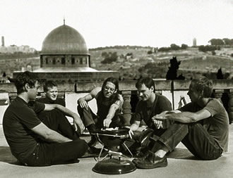
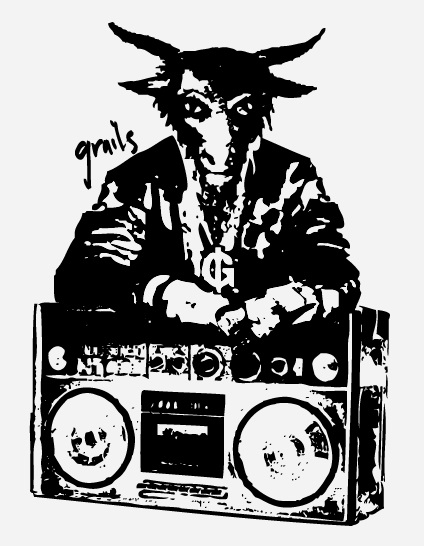

שמציגים הרכב חדש ולא מוכר למדי, נדרשים בד''כ לומר כמו מה הם נשמעים או באיזה סגנון הם מנגנים. עבור Grails, הגיבורים שלי מהשנה הזו, אני מנסה לקלף את ההגדרה הזו בכוח. שני ז'אנרים עולים לי בראש כשאני מנסה לאפיין את המוזיקה שהרביעייה הפורטלנדית הזו עושה: פוסט-רוק ומוזיקת עולם.

מה זה פוסט-רוק? דבר שמלכתחילה הוא כנראה בלתי ניתן להגדרה, כשהרעיון העיקרי הוא לנסות להשתמש בכלים של הרוק בכדי לשבור את הקונבנציות שלו עצמו, בעיקר בכל מה שקשור למבנה של השיר, וזאת מבלי, למשל, להיצמד ולינוק מסגנון מוכר אחר. מה זו מזיקת עולם? מוזיקה די משעממת. לא, רק חצי באמת. הכל יכול להיות מוזיקת עולם, כשחושבים על זה, כל עוד זה מייצג מקום והלך רוח של קבוצה (דבר שאפשר, תחת מגבלות, להתייחס אליו כאל ''תרבות''). למרבה הצער, בעוד שהפוסט רוק מנצל את החופש שלו, מתקדם ומושפע מסגנונות מבלי להיות מחויב להם, מוזיקת העולם הפכה להיות מונוטונית, צפויה, קשורה לערכים חסרי תוכן ממשי, או בקיצור, מקובעת להחריד, לא משהו שפיטר גבריאל, ממי שעזר לבסס את הסגנון-לא סגנון הזה, היה שמח ממש להכליל בהגדרה שלו למונח.רק שאצל Grails זה ממש לא כך.

אז למה אני קושר את שני הסגנונות האלו זה לזה, ואת הכל ל-Grails? לא יודע, אני מניח שזה עניין של התת מודע, והתת מודע מקבל על עצמו תפקיד משמעותי בכל הקשור לפוסט רוק ולמוזיקת העולם, במיוחד כשמדובר ברצועות אינסטרומנטאליות. כשאין לך עוגן בצורה של מילים, התודעה יכולה ללכת לאיבוד במוזיקה או לנסות ולהכניס אותה לתוך איזושהן קונבנציות. Grails מתפקדים כהרכב רוק לכל דבר, אך הם מקצים מקום רב לשילוב של כלים נוספים, כמו חלילים, כינורות, פעמונים טיבטיים ועוד (בשורוק), כמו גם לעבודת אולפן שיוצרת בסופו של דבר משהו שלרגעים נשמע כמו סוג של אמביאנס, מין מעטפת שכזו, שיוצרת לחץ מסוים על המאזין, ולעיתים כמרחבים של צליל, שמכילים בתוכם צלילים אחרים, שגולשים אל מעבר לשוליים של החלל שהוגדר להם. בסך הכל, המוזיקה פונה אל מוח הזוחלים שלנו, מגרה אותו, ורק אחר כך החלקים המפותחים יותר נאבקים למצוא לעצמם פירושים.

בתחילת דרכם, Grails הכניסו במודע אלמנטים של מוזיקה קלטית וגם סולמות מזרחיים למוזיקה שלהם, ועם הזמן הם פנו לכיוונים פסיכדליים יותר. אך Grails לא התרחקו בהרבה מהמקום בו התחילו את דרכם, אלא שהם פיתחו יותר את הסגנון שלהם, או הרחיבו את מקורות ההשפעה שלהם, אם תרצו. ב-Burning of impurities המצוין שהוציאו ב-2007, אפשר לשמוע בצורה טובה את השילוב בין כל האלמנטים שציינתי, וב-Doomsdayer's holiday (כמו גם במידה פחותה באלבום הנוסף שהוציאו השנה, Take refuge in clean living , שלפרקים נשמע כמגשר בין השניים שציינתי קודם לכן) הלהקה כבר לוקחת צד אגרסיבי אף יותר, רוקיסטי יותר עם תרצו, ועדיין נשמעת מקורית לחלוטין. מקורית עד כדי כך, שכאשר הם עלו לי לגמרי במקרה בתחנת רדיו שפתחתי ב-Last.fm ושמעתי תוך כדי ביצוע מיליון ואחד דברים אחרים, היה לי ברור שיש כאן משהו מיוחד במעטפת שנשמעת מוכרת, משהו שאני לא יכול למצוא לו תחליף או מקבילה.

Doomsdayer's holiday מתחיל מאוד אינטנסיבי, בצרחות שנשמעות כמו סומפלו מסרט אימה זול ונשכח, ומיד אחר כך התופים הולמים בכבדות, אפקט אטמוספרי חללי נוגד ומשלים אותם בו זמנית והגיטרות החשמליות נכנסות בתורן, חזקות וברורות יותר מכל מה ש-Grails סיפקו לנו באלבומים האחרונים שלהם. הכינור הוא הכלי הבולט בקטע הבא, Reincarnation Blues (איזה שם גאוני!). הוא נותן את הטון בהתחלה ואחר כך מערער אותו, הגיטרות נסחפות בהנאה הרחק מהציר של הקטע, כשרק הבאס שומר על אחדות כלשהי, גם כן, רק עד שלב מסוים. הקטע הזה מתחיל באופן מובנה ומהודק, מה שלא רגילים לקבל מ - Grails, והוא מסתיים בהורדת הילוך מהירה אל תוך קטע אמבייאנט אפל. 

כל הקטעים מראים שוני משמעותי זה מזה. The Natural man, הקטע השלישי, כבר מזכיר הרבה יותר את Grails של Burning of impurities והוא מהווה סוג של רגיעה, עם הנגינה האיטית, כמעט על גבול האיזי ליסטניניג שבו, החלילים והמפוחית העדינה, אבל אם תאמצו טוב את האוזניים, תוכלו לשמוע לפרקים צרחות כמו אלו שפתחו את האלבום. Predestination Blues לוקח אותנו לכיוון מזרחי יותר, עם מקצב איטי וממסטל וקטעי גיטרה מהפנטים, מלווים בפעמונים פה ושם. שאחריהם קטע ביניים ארוך שבו אובדן המלודיה הרגעי גורם למאזין להיות מרותק, צמא לקראת השינוי הבא. בסוף שני החלקים השונים מתמזגים יחד והופכים לדבר חדש, גדול ועוצמתי הרבה יותר. לבסוף מגיע הקטע הארוך ביותר, Acid rain, מלווה בסלייד, והוא הפוך לחלוטין מן הקטע הפותח. הוא אוורירי, מרגיע, נשמע רענן כמו העולם שאחרי גשם כבד, אבל, בל נשכח, מדובר ב''גשם חומצי'', ברכה שמתגלית כקללה.

למרות שאין מילים של ממש באלבום (יש קצת ווקלס חסרי משמעות וסימפולים, אבל לא משהו שמעביר מסר של ממש בשפה דבורה), לשם האלבום יש מין משמעות. הוא נשמע לעיתים מלחיץ ותהומי, כבר מצרחות הזעם/אימה/ייאוש שפותחות אותו, אבל יש בו גרוב, ואני מעז ולומר שנשמע של-Grails לא חסר חוש הומור. הדבר בא לידי ביטוי בעיקר בשמות אלבומים אחרים שלהם. ציינתי את ''ביעור הטומאות'', ואפשר להוסיף לכך גם את ''נבואות שחורות כזפת''. מי שיראה קטעים של החבר'ה האלה בהופעה, או שיציץ בקליפ הזה יוכל למצוא עדויות להומור, שבאות לידי ביטוי, ובעצם מאפשרות, את היצירתיות במוזיקה שלהם. אפוקליפסה, אבל בפנאן.

אמרתי שמוזיקת עולם היא דבר די מונוטוני ומקובע. למרבה הצער, רבים מדי לקחו את הרעיון המקורי והיפה והחליפו אותו במשהו בסגנון ''זה עולם קטן מאוד'' של דיסני. אז הנה מבזק חדשות- העולם הוא לא כזה מקום שכולו סבבה, בני אדם לא מתכנסים בכל רחבי תבל והוגים רק בשלום, אהבה ואצילות הבאפלו. התרבות האנושית בכל מקום הקצתה מקום למיניות פרועה, לאבדון, לחזיונות אפלים, ולפעמים גם קשרה את כולם זה בזה. אבל כאן טמון חלק מהיופי, בדמיון שלנו שמשתולל לנוכח החשכה, שיוצר פחדים ואחר כך מאמץ אותם. אותו תת מודע משותף שמכיל תשוקה וזוועה מוצא לעצמו ביטויים בכל מקום, ו-Grails מוציאים אותו לשחק קצת בחוץ, באולפן הקלטות, שם הם יוצרים פסקול של בני ימינו לאותן נבואות ורעיונות שלעולם לא מפסיקים למצוא להם דוברים וקהל. לא צריך לפחד באמת, זה הכל בראש שלנו.

**Reincarnation blue **
<iframe width="420" height="315" src="http://www.youtube.com/embed/gwBBKOu73Qw" frameborder="0" allowfullscreen></iframe>