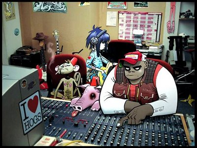

בחודשים האחרונים, המוזיקה השחורה על סוגיה, וההיפ-הופ בפרט, אוכלים כל חלקה טובה בעולם המוזיקלי, עד כי דומה שאף אחד אינו מחוסן בפניה. חתולי אשפתות דוגמת סאול וויליאמס, שהופכים בין לילה לגיבורי תרבות בקרב שורדי שכונות עארסים ויאפים עם ג`יפים כאחד. קוואמי ולירון נהיו נביאי המוזיקה השחורה בארץ, ערבי של''ג נהיו ה-מקום להראות בו, ופרוייקטים בעלי נטיות שחורות, דוגמת שוטי הנבואה וסאבלימינל צצים כפטריות אחרי הגשם. 

תהיתי על פשר תופעה זו ארוכות, בין אם ביני לבין עצמי ובין אם על גלי האתר, או גלי האייסיקיו, או שיחות סלון אלו או אחרות. מה קרה, שפתאום כדי להיות מישהו, מן ההכרח שתדע מה בין האנדסום בוי מודלינג סקול לבין ג`וראסיק פייב? וכמו שצריך להיות, התשובה לא באה עם ליהוגים מיותרים ופלצנויות בסגנון. היא פשוט צנחה עליי כשם שפסנתרים ומשקולות 16 טון עושים דרכם ממרפסות אל ראשי עוברים ושבים מונפשים בקארטוני האחים וורנר (ואלו קמים לתחיה בנונשלנטיות אופיינית לסילבסטר ואחיו). הגורילאז, בייבי, הם אלו שגרמו לי להבין מה בדיוק גורם לאלפי ישראלים לנענע ישבנם בחינניות למשמע הצלילים הללו. או שמא הגורילות הנ''ל הן מקרה חריג? זאת לא אדע, עד שאנצל את הדבר הנפלא הזה שנקרא אינטרנט כדי לחקור קצת את העסק. 

בכל אופן, את קלינט איסטווד שמעתי כמה פעמים ב''צינורות המקובלים'', והחלטתי שהוא חביב ביותר, אך החשד שלי היה שכיוון שדיימון, אהובי המזדקן, מספק פה את הקולות, הרי שדעתי משוחדת. אחרי נדנודים חוזרים ונשנים מצד אדם שבטעמו המוזיקלי אני בוטחת בעיניים עצומות, והמלצות חמות מרבים שדעתם נחשבת בעיניי, הטרחתי את עצמי והורדתי את האלבום המדובר. לא ציפיתי ליותר מדי, וקיבלתי את זה ישר לבטן. ישר לתחת. ושהאנימטור הראשי של כל העסק הזה שנקרא מוזיקה יפיל עליי משקולת 16 טון עכשיו, אם האלבום הזה הוא לא הדבר הכי מרענן שעבר לי באוזניים בחודשים האחרונים. 

קצת ביוגרפיה, כדי לסבר את האוזן. הגורילות הם סופר גרופ במונחים מודרניים. קחו את דיימון אולברן לבלר, דן ''האוטומטור'' ודל פאנקי הומוספיאן לדלטרון 3030 וחברים אלו או אחרים שיסלחו לי על כי שמם פרח מזכרוני, לצ'יבו מאטו והטום טום קלאב - וכמו שאומרים, וואלה לה רזולטאט. העניין היחיד הוא, שהם להקה וירטואלית לכל דבר. חברי הלהקה עצמה מופיעים כדמויות מצויירות, שנוצרו ע''י יוצר הקומיקס שהפך סרט קאלט לכל דבר - טאנק גירל. מעבר למוזיקה, יש גם משחק מחשב, אתר מעוצב יפהפה, ואני מניחה שגם שפע מרצ'נדייז, אצל תושבי המדינות המתועשות. זה שיתוף פעולה שנשמע טוב על הנייר, ונשמע עוד הרבה יותר טוב באמפי3ים מקודדים באיכות גבוהה (ובקרוב בדיסק, בקרוב בדיסק).

פרס כספי מובטח למי שימצא תמונה של האנשים מאחורי הציור 

מה שמקסים בהרכב הזה, הוא שהחברים בו, גאונים במונחים שהם כבר קרוס-ז`אנר, חברו יחד והוכיחו יכולת מופלאה לשתף פעולה בקונטקסט קריאייטיבי ולספק תוצאות מה-זה מגניבות. וזאת האוירה השולטת באלבום, קוליות בלתי נדלית. הוא מלא בשירים כאלה, שהם גם מדבקים טוטאלית במונחי הקהל הרחב, וגם אינטנסיביים ביותר, כשמדובר באיכויות מוזיקליות. הסאונד השולט הוא המקצבים האלה של ההיפ-הופ, עד שדיימון מפגין את יכולותיו הווקאליות והופך את השירים לכאלה שנשמעים לחלוטין כמו בלר ב-13 (שבזמן האחרון הולך והופך לאלבום החביב עליי משלהם). 

ההבדל בין שיתוף הפעולה הזה לבלר, הוא שהגורילאז ניחנו בהעזה הזאת, שבלר מפגינים אמנם בשני האלבומים האחרונים, אבל לא במידה מספקת. כבר אמרתי, ואני דבקה בדעתי, שזה האלבום שבלר אף פעם לא עשו. ואולי ככה אני צריכה לאכול את כל ההיפ-הופ הזה. בשירים שמהשניות הראשונות שלהם לא ניתן לדעת אם הם יהיו אינדי-רוק או היפ-הופ, דל או דיימון. האקלקטיות הזאת, כמה טוב היא יכולה לעשות לנשמה. 

אלבומים כאלה, שנמצאים על קו התפר, מראים עד כמה הטשטשו הגבולות בשנים האחרונות. ואלה לא רק בלר, או הגורילות, במקרה המדובר. גם הסופר פרי אנימלז, הבטא באנד, מאני מארק ואי אלו אחרים, מראים איך אפשר לחבר את שני העולמות ולהצליח בגדול. לא נותר לי אלא להוריד את הכובע בפני אמנים כאלו, שמסתבר שאחרי שהחזירו את התקליטים של הסמול פייסז לארון, הם עברו לנקות את האבק גם מפרלמנט וראן די.אמ.סי. נשמע מצחיק, ובמחשבה שניה, זה באמת מצחיק, אבל ההרכב הזה עוד הולך להצליח בגדול. ותסמכו עליי, עוד כמה שנים, רוב המוזיקה שלנו תשמע כך.
