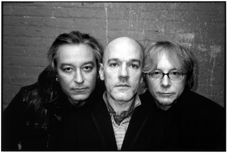
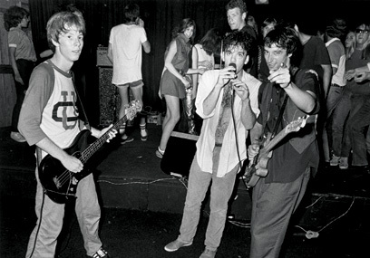

נורא קל לכתוב ביקורת על אלבום משמעותי ששינה את נקודת המבט שלך לגמרי, שכל האזנה אליו מחזירה אותך תמיד לתקופה חשובה בחיים שלך. נורא קל גם לכתוב ביקורת על אלבום גרוע שאתה שונא - כל שיש לעשות הוא לגשת לאינטרנט, להוריד את החדש של בריטני ספירס, להקשיב לו פעם אחת בזלזול מופגן ולהוציא תחת ידיך ביקורת שנונה וקוטלת, שתגרום לכל חובבי האלטרנטיב לחייך בשביעות רצון. אבל איך כותבים ביקורת על להקה מעולה, שהוציאה מתישהו במהלך הקריירה הארוכה שלה אלבום שהוא באמצע כזה, לא טוב ולא רע, אלא רק בסדר ואולי קצת יותר? זה כבר עסק יותר מורכב.

בשנת 1988, אחרי חמישה אלבומי אינדי בלייבל האמריקאי IRS, אר.אי.אם חותמים בחברת התקליטים של האחים וורנר, שהיא כידוע חברה גדולה ומסועפת הרבה (הרבה) יותר. אף אחד לא יודע למה לצפות, האם האלבום הראשון שלהם בוורנר ימשיך את הסאונד האלטרנטיבי הייחודי להם, או שהלהקה תחתוך לכיוון מסחרי יותר שיביא לה גם קהל חדש? התשובה לשאלה הזאת נעה בין ''גם וגם'' לבין ''לא זה ולא זה''.

באמת שאין צורך לחזור ולומר את זה, אבל בכל זאת - חמשת אלבומי האולפן הראשונים של אר.אי.אם ב-IRS היו יפהפיים, מהפנטים כל אחד בדרכו, כאלה שהגדירו למעשה את המונח ''אלטרנטיב'' ושינו את הנוף המוזיקלי של שנות השמונים. בשנות התשעים תזכה הלהקה לשיא הצלחתה ותוציא (בסדר הזה) אלבום מתוק ומלא בכינורות, אלבום מלנכולי-גלגל''צי, אלבום גראנג' ניסיוני, אלבום מעבר מקסים ואלבום אלקטרוני בהשפעת רדיוהד, ובין שתי התקופות האלה יושב לו Green, לא כאן ולא שם, כבר לא שייך ל-IRS אבל גם עדיין לא לשנות התשעים. איך מתייחסים לאלבום כזה? מה הסגנון שלו בכלל? איך זה שהאלבום הספציפי הזה של אר.אי.אם לא זוכה להכרה ביקורתית כמו קודמיו וממשיכיו? הייתכן שזה ה''עוד אלבום'' הראשון של אר.אי.אם?

לפחות מבחינת הארטוורק, מעריצי אר.אי.אם שקנו את האלבום בזמן אמת יכלו לנשום לרווחה; אר.אי.אם הקפידו לעצב את עטיפות אלבומיהם בצורה ייחודית ומסתורית, והוא לא שונה מהם מהבחינה הזאת. רוצים דוגמאות? בבקשה: לאלבום קוראים Green אבל העטיפה בכלל בצבע כתום, השיר הרביעי מסומן באות R במקום במספר 4, רק שיר אחד (''World Leader Pretend'') זוכה לכך שהמילים שלו יופיעו בחוברת, לשיר האחרון אין שם והוא בכלל לא מוזכר ברשימת השירים, בעטיפה מופיעה רשימת עצות נוגעת ללב ברוח שנות השמונים, שעיקרה הוא איך המאזינים צריכים לשמור על התקליטור על מנת שיוכלו להנות ממנו עוד שנים רבות. עוד ברוח זאת מופיעה הודעה הטוענת שהאלבום הוקלט באמצעים אנלוגיים ורק אחר כך עבר הסבה לדיגיטלי, ולכן חלק מהצליל לא עבר באופן חלק לסי.די. וזאת גם אחת הבעיות המרכזיות- הסאונד שלו מיושן, חינני בדרכו אמנם, אבל ממש לא עומד במבחן הזמן.

ומה עם המוזיקה עצמה, אתם שואלים? או. באופן עקרוני, השירים מתחלקים לשלושה סוגים: שירי רוק עוצמתיים, שירי פופ קלילים ולא מזיקים ובלדות שקטות ומוזרות. שירי הרוק כולם מעולים, הבלדות גם. את שירי הפופ הייתי שומר לאלבום אחר. שיהיה ברור, אני מאוד אוהב אלבומים מגוונים שכל שיר בהם נשמע אחרת לגמרי מקודמו. הבעיה היא שההבדל בין השירים מורגש מדי ושלושת הסגנונות הנ''ל לעולם אינם נפגשים, כך שהתוצאה הסופית היא אלבום פופ-פופ-בלדה-פופ-רוק-בלדה-רוק-פופ-בלדה-רוק-פופ. זה לא אחיד, זה מבלבל, ובשורה התחתונה - זה פשוט לא עובד - וככה יוצא שלמרות שהאלבום כולל כמה מהרגעים החזקים והיפים ביותר בקריירה של הלהקה, המחשבה הסופית שלי לאחר שגמרתי להאזין לאלבום היא: ''נחמד, אבל היה אפשר לשפר קצת''. ואולי אפילו לשפר הרבה, שכאמור שלושת הסגנונות נפרדים זה מזה ולא באמת מתחברים, לכן הביקורת שלי תהיה כתובה בהתאם ותתייחס לכל סגנון בנפרד.

**פופ**

המילה פופ מעוררת אצלי רתיעה, במיוחד כשמשתמשים בה מבקרי מוזיקה. כשמישהו כמו שרון מולדאבי אומר על שיר שהוא ''אחד השירים הגדולים בהיסטוריה של הפופ'' ולא סתם - ''אחד השירים הגדולים בהיסטוריה'' - זה נשמע מאולץ, מלאכותי, פלורליסטי בכוח, כאילו רצה המבקר לומר: ''תראו אותי! אני אמנם מבקר בעל טעם איכותי ואלטרנטיבי, אבל עדיין קשוב לקולו של העם''. מה אפשר לעשות, אם כן, כאשר השיר הראשון באלבום מצהיר על עצמו במופגן שהוא שיר פופ, ועוד כדבריו, ''Pop Song 89''? (להזכירכם, האלבום יצא בשנת 1988...) אי אפשר שלא להתייחס לזה כאל סוג של גימיק. ככה גם השיר נשמע, כמו גם השיר שאחריו, שיר פופ של אר.אי.אם משנות השמונים; זה קליט, זה מרקיד, זה כיפי, אבל בת'כלס אין פה אמירה. הוא הדין לגבי הלהיט ''Stand'', שהוא אמנם שיר חיובי וחמוד, אבל שום דבר מעבר לזה. אולי באלבום כמו Out Of Time או Reveal זה היה יכול איכשהו להסתדר, אבל כאן הניגוד בין הקלילות של הפופ לרצינות של הרוק פשוט חד מדי. ''Turn You Inside-Out'' בכלל נשמע כמו שיר איצטדיונים נפוח (או לחלופין כמו בי-סייד של פיטר גבריאל), וגורם לך להבין שאולי בכל זאת כולם צודקים כשהם אומרים שטוב ששנות השמונים נגמרו. השיר האחרון, זה שאין לו שם, מדגים את הבעיה הזאת נהדר- הוא נשמע טוב, כיף להאזין לו, אבל שנייה אחרי שהאלבום נגמר כבר שכחת את הלחן. אולי בגלל זה אין לו שם.

**בלדות** 

לבלדות של אר.אי.אם יש תכונה קסומה, נוסטלגית, מתוקה-מרירה, ו-Green לא שונה במובן הזה. ''You Are The Everything'' מתאר זיכרון ילדות חזק של הירדמות במושב האחורי במכונית כשאבא נוהג, תחושת ביטחון בלתי תלויה. קשה שלא להתמוגג מהשיר הזה. ''The Wrong Child'' אפילו עוד יותר מרגש; כלי המיתר והטקסט נשזרים זה בזה עד שכמעט אפשר לראות תמונה מול העיניים, תמונה מטושטשת כזאת, של ילדות בודדת-מלנכולית בפרברים האמריקאים, כמו סצנה מסיפור של ריימונד קארבר. כשהייתי ילד קטן, פגשתי בגן הפיראטים בגבעתיים ילד אחר. שאלתי אותו אם הוא רוצה להיות חבר שלי והוא אמר שכן, ועוד צעק בהתלהבות לאימא שלו: ''אימא! יש לי חבר חדש!''. שיחקנו איזה חצי שעה עד שהייתי צריך ללכת הביתה. מאז לא ראיתי את הילד הזה יותר בחיים שלי. ''The Wrong Child'' מחזיר אותי בדיוק לזיכרון הזה. למה? אני לא יכול להסביר. וזה כל הקסם.

צעירים ויפים בשנות השמונים

**רוק** 

בקטגוריה הזאת כבר לא הייתי מוותר על אף שיר. לא סתם בחרה הלהקה לצרף לחוברת רק את הטקסט של ''World Leader Pretend'' ולוותר על כל השאר. זה שיר חזק ומעורר השראה על אדם שבוחר בדרך שלו, שלא מוכן שידרכו עליו יותר, שיש לו כיוון והוא לא מתכוון לוותר עליו, אפילו אם זה אומר שהוא יילך בדרך הזאת לבד. ''Orange Crush'' הוא קלאסיקת אר.אי.אם לכל דבר ועניין, חברי הלהקה טוענים שהשיר הושפע ממלחמת וייטנאם, לי המילה crush דווקא עושה אסוציאציה לאהבה בלתי מושגת שכיף להתפלש בה, כך או כך, זה שיר פשוט אדיר. ראויה לשבח גם היצירתיות שבמבנה שלו, כי אין לו ממש בתים, רק פזמון וקטעי מעבר. ''I Remember California'' הוא כנראה השיר הטוב ביותר באלבום; הגיטרה של פיטר באק חותכת בכאב, התופים של ביל ברי הולמים בכוח, ומייקל סטייפ שר על תקופה יפה שכבר לא תחזור לעולם, אבל הוא מסרב להיפרד מהזיכרון שלה. ההכרה הכואבת הזאת, שמשהו שאהבת יסתיים ולא ישוב יותר, מכה במאזין במלוא העוצמה. היה עדיף לאר.אי.אם לסיים את האלבום כאן במקום לתקוע בסוף את השיר ההוא שאף אחד לא זוכר כי בכלל אין לו שם.

איך לסכם את האלבום הזה? טוב? לא טוב? מרגש? לא מרגש מספיק? גם וגם וגם וגם. יכול להיות שאני לבד בדעה הזאת, כי חלק ממעריצי הלהקה השרופים, אלה שהתחילו איתם משנות השמונים, עדיין נשבעים בשמו של האלבום הזה וחושבים שהוא מעולה. והוא אכן מעולה. בחלקו. גם זה משהו.

World leader pretend 
<iframe width="420" height="315" src="http://www.youtube.com/embed/NDhOKNlbuwM" frameborder="0" allowfullscreen></iframe>