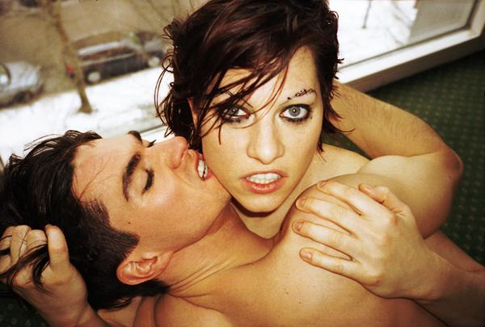

שני אלבומים יצאו בשנת 2008 מתחת לידי הפסנתרנית של אמנדה פאלמר. הראשון והמאוחר יותר הוא הסולו הראשון שלה, ''?Who killed Amanda Palmer'' (עם קריצה ברורה לטווין פיקס), והשני, המוקדם יותר, הוא זה שאותו בחרתי כגיבור הלא מושר שלי לשנת 2008. ''מי רצח...'' מושקע יותר לכאורה, ובתור כרטיס הביקור של פאלמר כסולנית קומפלט, הוא גם אמור להיות מחייב יותר. למען האמת, הדיסק הזה, נכון לכתיבת שורות אלו, אכזב אותי מאוד, בעוד ש''No, Virginia'', שנחשב לאלבום של שאריות מ''Yes, Virginia'', השני של הדרזדן דולס, ושל עוד כמה צ'ופרים חדשים, הוא לטעמי הצלחה של ממש, למרות שלכאורה הוא אינו עומד בפני עצמו.

עלי להתנצל. אמנם בחרתי לי דיסק גיבור, אבל אין מנוס מהתייחסות ל''מי רצח...'', בעיקר בשל הקרבה במועד ההוצאה, אבל לא רק. גם עבור חובבת דרזדנים כמוני, שני דיסקים תוך חצי שנה של אמנדה הם יותר מדי, אז מוטלת החובה לבחור, ואולי הסולו יקבל יותר תשומת לב וזמן סטריאו בעתיד. ההנמקה: בעוד שהסולו של אמנדה פומפוזי מצד אחד ולא מחדש שום דבר מאידך, ''לא, וירג'יניה'' נשאר באותו הקו, או יותר נכון במנעד שאותו התוו קודמיו- שירי פסנתר מרירים עם רמז של מתיקות, מינימליזם, נוירוזה בריאה, המון הומור עצמי ובעיקר- הרצון לעשות לכולם נא- גם באוזן, גם בעין. למה אני מסתבכת כל כך, משל הייתי אמנדה בעצמי- פשוט יש כאן אסופה של שירים טובים, שירים טובים מאוד. 

הדבר החשוב ביותר שיש לי לומר על אמנדה פאלמר הוא, שהיא כותבת שירים מופלאה, כישרון טבעי. אני לא יודעת איך בזמן כל כך קצר היא הצליחה לכתוב כל כך הרבה שירים טובים לאורך הקריירה שלה בדרזדן דולס. נשמע שכמו שהיא מכה בכוח ובמהירות על הקלידים - כך היא גם יוצרת את השירים שלה. ברוב המקרים (ואנחנו עדיין מדברים על הדרזדנים בלבד) - אין פקשושים. אמנדה מצליחה כמעט תמיד למצוא תמיד את הגוון הנכון - גם על הפסנתר, גם במילים וגם בקול. אפשר להאשים את אמנדה פאלמר בהמון דברים, אבל אף אחד לא יכול להכחיש את גודל הכישרון. בדיסק הזה, אלבום ה''שאריות'', היתומים שלא מצאו את עצמם באלבום ש''עומד בפני עצמו'', הדבר בולט במיוחד, במיוחד מכיוון שהוא מכיל כמה מהשירים הטובים שפאלמר הוציאה עד היום, דבר שאי אפשר לומר על הסולו, שהמבנה של שיריו נאנקים תחת מאמץ יתר והמגוון הכלי לא תורם כמעט במאום. נונשלנטיות, זהו מרכיב הקסמים שמתאזן מצוין עם התיאטרליות, והרי בקברט עסקינן.

מהשנייה הראשונה של ''לא, וירג'יניה'' המאזין ימצא את עצמו במצב של איתנו-או- נגדנו. ''Dear Jenny'', על השירה החזקה שבו והטון הסרקסטי, לא מכיל איזשהו אינטרו סטייל ''Good day'' מאלבום הבכורה של הדרזדנ'ס. את אמנדה או שאוהבים או שלא, ומי ששייך לקבוצה הראשונה יתענג במהרה על עוד שיר מוצלח, שבעולם טוב יותר, כזה שבו היינו מתלבשות במחוכים וביריות ולא בסקיני ג'ינס, היה נחשב ללהיט לגיטימי. ''Night reconisiense'' (סיור לילי בשטח אויב) המצוין אף הוא יעורר הזדהות בכל מי שחוזרת לעיירת הולדתה ומודה לאל שהימים ההם, מרובי הפדיחות, בהם המאבק על הזהות העצמית היה הרבה יותר קשה וגם הרבה יותר קריטי, נמצאים רחוק מאחוריה על ציר הזמן. רוצים להבין מה מתקתק את אמנדה (או אולי- מה הורג את אמנדה פאלמר?) בשיר הזה תמצאו את התשובה, ואולי, אם תפטרו ממטען של ציניות כנגד הציניות הפאלמרית, תבינו מדוע יש לה קהל מסור.

אם יש פסנתר, אז צריכות להיות מתישהו גם בלאדות, וגם כאן מקומן לא נפקד. בלדה זה די דומה לשוקולד- משהו שכמעט כל אחד עשוי לאהוב. אפשר לעשות ממנו פרלין משובח או ממרח שנדבק לשיניים. הרצף שסוגר את האלבום שייך כולו לסוג הטוב של הבלאדות- כאלו שמראות שהדרזדנים לא נתקעים רק ב''פאנק'' בהגדרתם העצמית כפאנקברט, ולאמנדה יש צד ענוג. היא אינה מעוניינת רק להתריס ולנפנף במיניות שלה. לפעמים, היא רוצה מישהו שפשוט אפשר לישון איתו, במובן הקונקרטי של המונח. Boston מעביר היטב את התחושה הזו, שמעבר לכעס ולהרפתקנות הלילית יש כמיהה גדולה לשלווה, כזו שתבוא רק אחרי שהכעס יעובד וישכך, גם אם לא ישכח.

אין ב''לא, וירג'יניה'' שיר אחד שלא למדתי מתישהו לאהוב. אפילו ''Sorry bunch'' החלש יחסית לאחרים זומזם על ידי במגוון הזדמנויות. התיפוף של בראיין וי(ג)ליון, הצלע ההרבה פחות דומיננטית בצמד הזה, נאמן כתמיד, ובהשוואה הבלתי נמנעת ל''מי הרג...'' אני חשה ממש בחסרונו. השילוב ביניהם, של שני כלים בלבד, עולה לטעמי בהרבה על כל ההפקה מרובת הכלים של בן פולדס בסולו. זו לא רק האנרגיה שהתיפוף מעניק לשירים, זה הסאונד בכללותו. דווקא כאשר מדובר בשני נגנים על שני כלים (ואולי קצת גיטרה פה ושם, שעליה מנגן ויליון/ויגליון) אפשר להרגיש בהבדל בין השירים ובחשיבותו של כל אחד מהם, כי הדגש על אומנות הכתיבה והביצוע, ולא על הטרראם שמסביב, שנאנק להשחיל את משמניו להגדרה של ''פאנקברט''.

הממתק האמיתי, השיר החזק ביותר באסופה הזו, הוא ללא ספק השיר בעל השם הבוטה ''Lonesome organist rapes page-turner''. כן, אני מניחה שאתם יכולים לנחש מהו שיא העלילה. לא, אני מניחה שחלקכם לא יעריך את ההומור השחור כשזה מגיע להקשר הזה, של אונס. למרות זאת, מדובר בשיר סוחף וממכר במיוחד, שבו פאלמר וויליון (זהו, סגרתי על השם שלו מבחינתי) מראים את הכימיה המטורפת שלהם ביחד, כזה שיש לו מילים ולחן כל כך מוצלחים, שאם הייתי רג'ינה ספקטור, פניי היו בוערות. בעצם, גם כאן אונס הוא לא ''פשוט'' אונס, ואם מחפשים טוב טוב במילות השיר, אפשר אולי למצוא איזשהו טון או רובד שמרמז לנו על קיומו של ניצול הדדי. ככה זה בעולם דקדנטי. 

בסך הכל, חבל לי ששירים כל כך טובים ייפלו בין הכיסאות ויאבדו את הפוקוס לטובת אלבום הסולו המעפן (הנה, אמרתי את זה) של אמנדה, אבל בשביל זה אני מניחה שטוב שיש את הגיבור. אולי פאלמר תמשיך לנסות ולהתניע את קריירת הסולו המצופה שלה, אולי היא תחליט גם להתבגר. כך או כך, לפחות ישנו מוסד, או סגנון מוזיקאלי, שאפשר ליחס אותו בלעדית אליה וגם לזקוף לזכותה משהו שאולי, ועם כל שמירת הפרופורציות שנדרשת, אפשר להתייחס אליו כאל קביעת אבן דרך, אולי אפילו יצירת סטנדרטים עבור הבועה שאותה מנפחים הדרזדן דולס .

Lonosome organist rapes page-turner
<iframe width="420" height="315" src="http://www.youtube.com/embed/_xoniTn7ygA" frameborder="0" allowfullscreen></iframe>
