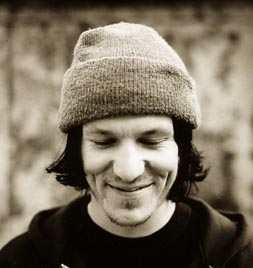
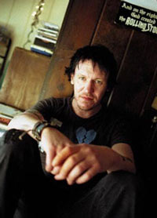

פעם, לפני הרבה שנים, היינו יוצאים ביום שישי וחוזרים לפנות בוקר. זה לא שהיה לאן לצאת, וגם לא ממש היה לאן לחזור, אבל העיקר היה להיות בחוץ. היינו צעירים, ורק הוצאנו רישיון (טוב, לפחות אחד מאיתנו), והחיים היו מלאי תקווה והבטחות של מה שיכול היה להיות. בערך באותו גיל גם גיליתי את אליוט סמית'. 

בערך באותה תקופה סמית' גם התגלה על-ידי במאי בשם גאס ואן סנט שהשתמש במספר שירים שלו מהאלבום ''either / or'' לפסקול הסרט ''סיפורו של וויל האנטינג'' ותרם לפרסום של סמית' עד כדי מועמדות לפרס והופעה בטקס האוסקר. בפסקול הסרט הופיע גם השיר ''no name #5'' מהאלבום ''Roman candle''. השיר ליווה את וויל וחבריו החוזרים הביתה לפנות בוקר מיציאה לפאב שכונתי. השמש זורחת וכולם, חוץ מהנהג, ישנים שנת מסטולים כשראשם מונח על החלון.

הסרט והפסקול התאימו בצורה מושלמת זה לזה. אני לא יודע מי היה קודם וזה לא כל כך אכפת לי, כי מהיום שקניתי את פסקול הסרט שמעתי אותו מיליון פעמים ודמיינתי איך גם אני, המסכן מהפרברים, מבטיח לחברה שלי במיטה הבטחות של אנשים קטנים, ונלחם מול העולם כמו גיבור מובס שנשאר לו אולי עוד כדור אחד בקנה. מהר רצתי לשמוע עוד שירים שלו, ומן הראוי היה להתחיל מהאלבום הראשון, שגם היה היחיד בחנות שבה שאלו אותי ''אליוט מי?''.

תשע רצועות יש בו באלבום הזה, וכמעט כולן מורכבות אך ורק מסמית' בגיטרה, כשמדי פעם מבליח איזה בס או מכונת תופים, אבל רוב הזמן אנחנו יכולים רק להביט בסמית' שר את עצמו. אני בכוונה אומר ''להביט'', כי יותר משסמית' שר - הוא מצייר תמונה במילים ברורות וחשופות, לפעמים עד כאב; כי מי צריך לקשט את המציאות, ולמי יש זמן בכלל? אם המדיום הוא באמת המסר, כמו שאמר פעם מרשל מקלוהן, אזי שהמסר של סמית' הוא הפשטות.

Roman candle הוא סוג של זיקוק - יפה ונוצץ, אבל אם תחזיק אותו ביד יותר מדי, יש סיכוי שתקבל כוויה לא קטנה, כי מתחת לציפוי היפה הזה, חשוב לזכור תמיד, בוערת אש. מתוך הניגוד הזה, בין יופי לכעס, יוצא סמית' ומצביע בלי להביע דעה על מה שקורה. מראה לנו את מה שיש בשכונה בה הוא חי, אותה שכונה שמצולמת על עטיפת האלבום, והיא השכונה אליה משתייך כל מי שכמו סמית' - מרגיש לא שייך - כמו הילדים שלא ישבו בספסל הקדמי באוטובוס. 

בשכונה הזאת יש שכן אחד שרוצה רק להתחיל לשתות ואז להמשיך בשיר ''Last call'', ויש שכן שמחפש את אשתו בכל העיר בשלוש לפנות בוקר ב-''Drive all over town''. 
זה לא באמת משנה אם סמית' שר בגוף ראשון או שלישי; האנשים האלה הם הוא באותה מידה שהם כל אחד מאיתנו. אבל בתוך כל העצב הזה יש אופטימיות זהירה. הקול הנהדר של סמית', שמדגיש כל מילה, מעביר את הרוך של שיריו בצורה נהדרת. המוזיקה עצמה, פשוטה ככל שתהיה, משרתת את המילים ולא מאפילה עליהן, אלא מציירת רקע כמעט נינוח. רק ברצועה האחרונה המוזיקה מגיעה כתמונה שלמה, נטולת מילים, והיא לטעמי דווקא החלשה באלבום. 
בגלל האופטימיות שהאלבום הזה משדר, המציאות הפכה כמעט לבלתי נתפסת, כשכמה שנים מאוחר יותר סמית' החליט לקחת את כל העצב הזה ולפרוק אותו לתוך עצמו, בדיוק כאילו שזה לקוח משיר שלו עצמו, עם סכין מדייקת ללב. אפילו כשהוא מרנן לנו את השורה שהיא לדעתי המוטו של האלבום - אם לא של מכלול השירים של סמית'- ''you know you don't belong here'', גם אז קשה לי לדמיין אותו עושה מעשה כל כך קיצוני.

מצד שני, אולי טוב שסמית' לא רואה איך העולם מתנהג כיום. בעולם שסוגד לגדולה ולכוכבים, קטנים כגדולים, שחלקם מעיזים בחוצפתם לעשות מחווה לסמית' (לא יכולתי להתאפק), ואין מקום למי שמספר סיפורים קטנים, ובעיקר אין מקום לכנות. היופי של סמית' מגיע לא מתוך איזו עטיפה אסתטית או תחכום מבני, אבל כשמישהו שר כל כך חשוף זה מוריד לי את כל ההגנות. אני לא צריך שיבוא מישהו מבחוץ ויגיד לי שזה דומה לחיים שלי, אני מרגיש את זה לבד. בעולם שבו שיר מגיע לרדיו אחרי שהוא נכתב בתור תרגיל של קבוצת מוזיקאים וככה הוא גם נשמע, אין מקום למי ששר על השכן האמיתי שלו, אלא אם כן קוראים לו שמעון וזה נשמע ממש יפה. בשביל אנשים כאלה, שגם היום לא שייכים, המציאו את סצנת המוזיקה העצמאית.

היום אין לי אוטו אלא קטנוע, ואת השמש אני כבר לא רואה זורחת בדרך למיטה, אלא בדרך מחוצה לה. העולם הוא מקום הרבה יותר קטן ממה שחשבתי, וזה בסדר. ישנה נחמה גדולה בוודאות של הדברים שכבר לא תעשה, שמאזנת את האכזבה מהדברים שכבר לא תספיק. כנראה שאף אחד לא יכתוב עלי שיר, וגם אני לא ממש חוטא בכתיבה מהסוג הזה, אבל טוב לי לדעת שהייתה וישנה מוזיקה שמייצגת גם אותי. טוב לי לדעת שגם היום, אני יכול להשעין את הראש על החלון, לפחות בצורה מטאפורית, לעצום את העיניים ולדעת שמישהו כבר ידאג להביא אותי הביתה.

No name #1 
<iframe width="420" height="315" src="http://www.youtube.com/embed/snc6xYGhzcU" frameborder="0" allowfullscreen></iframe>