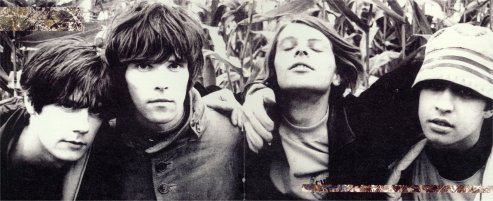
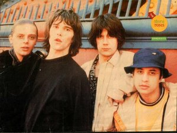

להלן פתיחה מוחצת: אלבום מושלם. נקודה.

לא אלאה אתכם בפסבדו-ביקורת טרנדית מפיו של האח גאלאגר על איך האלבום הזה השפיע על חייו (אולי קצת ממש), וגם לא אשתמש בטכניקת ''יומני היקר'' של מוריסי בו הוא מקלל עצמו לדעת על שלא כתב את I Am The Resurrection. במקום זה פשוט אכתוב ביקורת לאלבום שאני הכי אוהב. 

אלבומים שהם פורצי דרך מגיעים פעם ב-10 שנים לערך, וגם אז לוקח כמה שנים כדי להבין שהם היו כאלה. במקרה של הסטון רוזס, האימפקט היה מיידי. פשוט צריך לבנות תמונה חצויה נוסח לפני/אחרי של אנגליה בשנות ה-80 האפורות. 

לקראת סוף העשור ולאחר כמה שנים יבשות ודכדוך ת'אצ'ריסטי מתקדם, יצא אלבום הבכורה של הסטון רוזס ב-89'. בעקבותיו התפתחה לה תרבות מדצ'סטר המדוברת וצצו להם באורח פטרייתי ההאפי מנדייז, השרלטנז, אינספיירל קרפטס ואלוהים יודע כמה עוד הרכבים... עד היום אפשר להרגיש את אוושות האלבום הזה באי הבריטי: בהתחלה באו אואזיס, בלר, פריימל סקרים ושות', ואחריהם טראוויס, קולדפליי, ועד לקוקס של ימינו. אז נכון שהיו עוד השפעות אמריקאיות, וגם ברור שהמנדייז היו קיימים לפני האלבום הזה, אבל בחייכם, אפשר להתווכח בכלל על זה שהסטון רוזס היו מפיצי הבשורה של מנצ'סטר באותן השנים?

ועוד כמה דברים שאי אפשר להתווכח איתם: 
בראש ובראשונה - הקול של איאן בראון. אלוהים, איזה קול! אפילו בהופעה האחרונה בישראל אפשר עדיין להתפעל אחרי כל השנים. מלך הקופים אולי קצת חלוד עכשיו, אבל באלבום הזה יש משהו כל כך חלק בקול שלו, שמיימי אפילו, משירת הכמעט לחישה שלו ב-I Wanna Be Adored הנפלא (עוד נחזור אליו) ומצד שני, ההגייה הבריטית המוגזמת ב- Elephant Stone. כששומעים את השיר הזה בא לצעוק: 'ליאם, יא מעתיקן! איאן בראון עשה את זה קודם!', אבל אני די בטוח שאם תשאלו את ליאם הוא יודה וגם יגיד 'אז מה אם העתקתי? גם אח שלי העתיק מטי רקס ומהביטלס, מי אתם בכלל?! אתם על הזין שלי! איש הקוף הוא אלוהים'. צודק, ת'כלס.

חוץ מזה - ישנה הגיטרה של ג'ון סקווייר, כמובן. האם שמעתם פעם ריף גיטרה יותר טוב מהחצי השני של I Am The Resurrection? בכלל, האם שמעתם פעם שיר יותר טוב מהשיר הזה? איפה היום תמצאו אנשים שיכתבו שורות כמו: ''אני התחייה, ואני האור, אף פעם לא אוכל להביא את עצמי לשנוא אתכם כמו שהייתי רוצה''? זהו בראון בשיא המגלומניה שלו. אם אתם צריכים קצת בוסט לביטחון העצמי, תשמעו את השיר הזה ודמיינו למי אתם שרים אותו. תאמינו לי, זה עובד. 

ומיד אחריו, סקווייר מפציץ שוב ב- Fool's Gold, פשוט שיר שלא נותן לך לשבת בשקט, חייבים להתחיל לקפץ. השילוב בין התופים של רני, הבס של מני והגיטרה של סקווייר משאיר אותי נפעם כל פעם מחדש בשיר הזה. פשוט גרוב מדהים.

ויש כמובן את שיר ההלל הפיקטיבי She Bangs The Drums, ואת הפתיחה המופלאה של Waterfall. אפילו השיר הכי פופי שלהם, Made Of Stone, עם הפזמון שכאילו נתפר במידותיו לרדיו, לא מצליח להוריד את הרמה. פשוט שיר טוב וממכר. ומעל הכל עומד לו I Wanna Be Adored . איך שיר של 4 שורות יכול להיות כל כך מגוון, מרגש וממכר? אין ספק - בשבילי, זהו שיר הפתיחה הטוב בכל הזמנים. ועוד ועוד ועוד..

מפאת חוסר מקום לא אעבור שיר שיר, למרות שבהחלט יש על מה לעבור. כל שיר פוגע כאן. 
יתרה מכך, כל כמה חודשים אני מחליף את השיר האהוב עליי באלבום, עוד סממן לאלבום מושלם.
הבעיה היחידה עם אלבום מושלם היא שאין דרך להתעלות עליו.. ואכן הסטון רוזס פספסו באלבום השני שלהם, שיצא ב-95'. במקום זה, הם עשו את השיר המושלם, Love Spreads, ועטפו אותו באלבום בינוני ביותר, ממש כמו שבריאן וילסון עשה עם גוד וייבריישנס, אחרי פט סאונדס. 

ליבי ליבי אל יוצרי האלבומים המושלמים. אחרי הכל, איך מתעלים על אלבום מושלם?