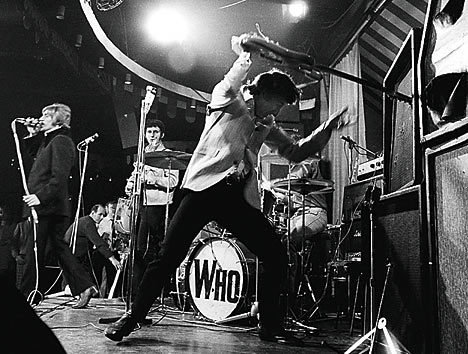

הכל התחיל בציטוט: ''אף אחד לא יכול להסביר מהו רוק'נרול, אולי חוץ מפיט טאונסנד'' (ג'ייסון לי, Almost' Famous'). אחרי שראיתי את הסרט הזה, הייתי חייב לבדוק מיהו אותו בחור שיכול להסביר לי מהו רוק'נרול... מאז אני עדיין בודק, בכל יום פעמיים, אם אפשר, מיהו פיט טאונסנד. ועדיין, לא ברור איך אין כרגע באתר הזה, נכון לכתיבת שורות אלו, אף ביקורת על אף אלבום של המי. שערורייה – החלטתי להתחיל באלבום החמישי שלהם, שהוא לא אלבום קונספט ולכן הוא גם מעט יותר ידידותי למשתמש.

אוקיי, אז מדריך המי למשתמש המתחיל: להקה עם 4 כיווני אוויר שונים. מצד אחד, קית' מון – אגדה של מתופף, שנקטף בצעירותו (כמו שרק אנשים מסוגו יכולים - ממנת יתר) והיה פסיכופט אמיתי בעל חיבה עזה לאלכוהול ו-ונדליזם. מהצד השני, ג'ון ''אצבעות קסם'' אנטוויסל – שלא הרבה במילים אבל היה באסיסט מהסרטים (וגם אחראי על My Wife, הפנינה ההומוריסטית שבאלבום המדובר), שגם הלך מאיתנו לפני כמה שנים. והשניים שעוד פה, יבדל''א: רוג'ר דאלטרי – הקול, העיניים, תלתלי הזהב, מסובב המיקרופונים, האריק איינשטיין של המי ואחד הסולנים המוכשרים בדורו. אבל מעל כולם, עומד לו פיט טאונסנד – היוצר, הסופר, המלחין, המוח. בעוד כל השאר הם מוזיקאים משכמם ומעלה, טאונסנד הוא קודם כל אמן, האיש שהמציא את מנהג שבירת הגיטרות על הבמה, המציא את תנועת תחנת הרוח בפריטה על הגיטרה, כתב והלחין 99% מהשירים של המי, טווה את כל אלבומי הקונספט והסיפורים מאחוריהם ועד היום נחשב לאחד המוחות הגדולים ביותר של הרוק. 

אחרי אלבום הקונספט המדהים שלהם, ''טומי'', טאונסנד, כמו כל גאון אמיתי (ע''ע בראיין וילסון אחרי פט סאונדס), חטף התמוטטות עצבים וגנז את אלבום הקונספט הבא – The LifeHouse Project. בתמצות, סיפור המסגרת של האלבום הגנוז הוא על עולם עתידני, אשר בעקבות הזיהום בו כל בני האדם מסוגרים בביתם וכולם מחוברים דרך צינורית לרשת מרכזית אחת, דרכה הם צורכים את כל מה שדרוש להם כדי לשרוד. במאמר מוסגר, ניתן בעצם להגיד שטאונסנד גם הקדים את זמנו והגה מודל קדום של האינטרנט של ימינו (הוא לא היחיד שעשה זאת, אבל אני די בטוח שהוא היחיד שעשה זאת וגם שבר גיטרות בוודסטוק). מהשאריות של הפרויקט, נוצר Who’s Next, אלבום שמייצג את האקלקטיות של הלהקה, עם שלל ביקורות חברתיות מלאות רצינות מחד לצד שירי נונסנס עם הומור בריטי משובח מאידך. 

היות ואני חובב מושבע של פתיחת אלבומים, לא אפסח על הפתיחה המוחצת של האלבום – Baba O'Riley. השיר נקרא על שמו של המאהר באבא, שטאונסנד הושפע ממנו רבות ואף תיכנן במקור להכניס לסינתיסייזר שלו את קורות חייו של הבאבא וכאשר את הפלט שיתקבל בצורת מוזיקה ישים כמוזיקת הרקע של השיר. בשיר מוצגות הדמויות המרכזיות בסיפור מאחורי האלבום, משפחת חקלאים סקוטית החיה בשולי איזור הזיהום ושומעת על קונצרט שעתיד להתרחש בלונדון ואולי יוציא את בריטניה מהאדישות ויינער את כל החברה המנוונת. גם כאן קשה (לי) שלא להעריך את טאונסנד על המחשבה והיצירתיות. מאחורי כל שיר, כל אלבום וכל לחן מסתתר עולם ומלואו, עד שנדמה כי נדרשת עבודה סמינריונית מקיפה כדי להקיף את כל פועלו של האיש. בחזרה למוזיקה - Baba O’Riley הוא שיר אפי לכל דבר, וכיאה לכך משנה מקצב כמה פעמים במהלכו, כאשר גם דאלטרי וגם טאונסנד תורמים את קולם, ובסופו כמובן ישנו קטע הכינור הנהדר שהולך ומצטמצם עד לסיום. אין ספק, זוהי פנינת רוק'נרול שלעולם לא תימאס.

שאר האלבום מחולק לשניים, כאשר החלק הקליל יותר כולל שירים כמו My Wife הקורע מצחוק (אותו כתב אנטוויסל כאמור) על הגבר שמפחד פחד מוות מאשתו ומעדיף להיות עצור במשטרה מאשר להתמודד איתה ו - Going Mobile, שמספר על החיים בקרוון. המילים של טאונסנד באמת עושות חשק לעלות על איזה RV ולחצות את ארה''ב לרוחב:

“I don’t care about pollution/ I’m an air-condition gypsy/ That’s my solution/ watch the police and the taxmen miss me when I’m mobile ” 

מנגד, ישנו החלק הנוגה יותר, כאשר טאונסנד ב- Over The Song is ודאלטרי ב Behind Blue Eyes כאילו מתחרים ביניהם מי מצליח לרגש עד דמעות יותר בשירתם. אגב, התחרות בין השניים הייתה ממש-לא-סמויה ולעיתים אף גלשה לאלימות, כאשר בתקרית אחת טאונסנד הניף לעבר ראשו של דאלטרי את הגיטרה שלו ובתמורה דאלטרי החזיר באגרוף לבטנו של טאונסנד. השניים, שהיו ללא ספק החלק הדומיננטי ביותר של הלהקה, מעולם לא הסתדרו ביניהם,כיאה ללהקת רוק עם יותר מדי אגו. הריבים שלהם היו מתוקשרים ובוטים, ורק בשנים האחרונות ניתן להגיד שהם כבר מעט יותר מפוייסים. אבל לדעתי חלק גדול מההצלחה של הלהקה נבע בעיקר בשל העובדה שהיה פה תמהיל של ארבעה אנשים בעלי אופי כל כך מנוגד אחד לשני, שהוביל מצד אחד לסכסוכים בלתי נגמרים ומצד שני ליצירות מוזיקליות משובחות.

כיאה לאלבום קונספט, הטוב ביותר שמור לסוף - השיר האחרון Won’t get Fooled Again, בו כל היכולות של חברי הלהקה באות לידי ביטוי במיטבן באחד משירי הרוק הטובים ביותר בכל הזמנים, אם לא הטוב שבהם (המממ... אני כבר רואה את הטוקבקים...). המילים של טאונסנד מהממות, כמו גם הצרחה של דאלטרי בסיום, שהוכתרה כלא פחות מרגע מכונן בהיסטוריה של הרוק, התיפוף התזזיתי בטירוף של מון, הסינתיסייזר בקטעי המעבר, פשוט יצירה שקשה להתעלות עליה. המסר האנטי-קפיטליסטי מהשיר שמבטיח לנו “Meet the new boss/same as the old boss” תמיד עולה בזכרוני כשאני נתקל במערכתיות מהסוג הנלוז שפוגשים בארגונים ובתאגידים. המי מבטיחים לנו שכל אלה שמבטיחים לנו שינוי – אף פעם לא יקיימו, ובכל זאת, להם זה לא ממש מזיז, הם פשוט יחייכו, ירימו את הגיטרה, וינגנו בדיוק כמו אתמול. כי עליהם כבר לא תצליחו לעבוד.

<iframe width="420" height="315" src="http://www.youtube.com/embed/Rp6-wG5LLqE" frameborder="0" allowfullscreen></iframe>